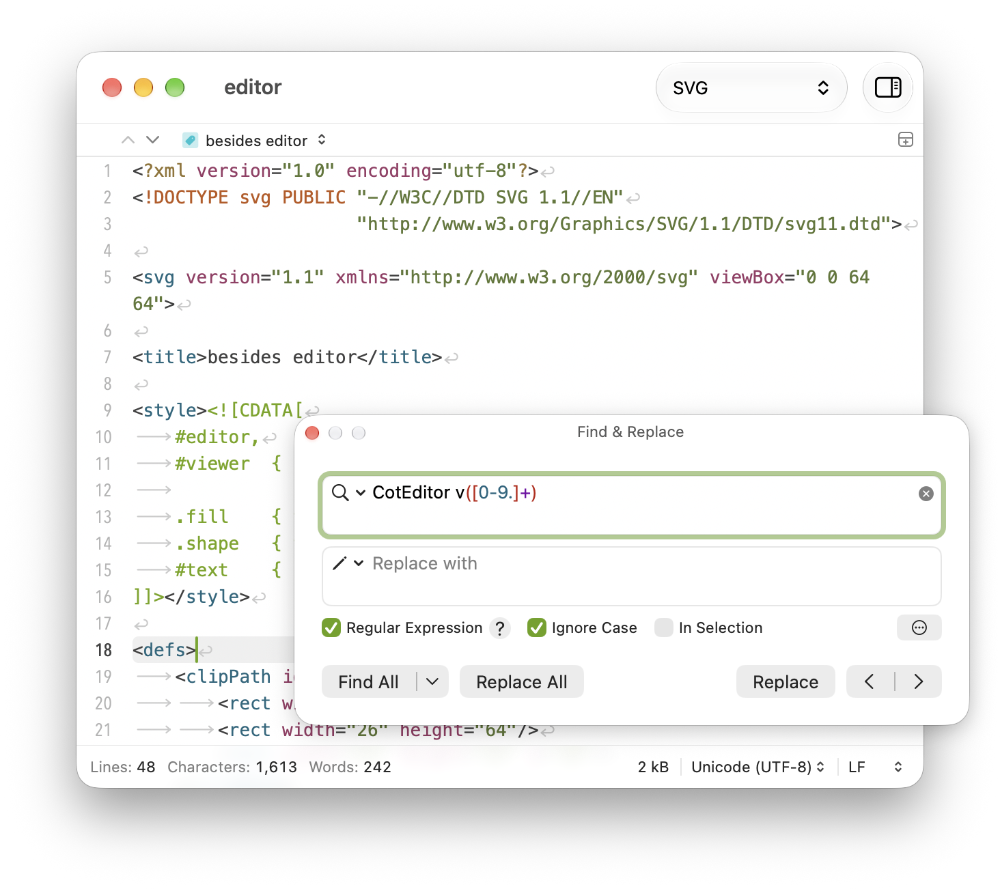

# CompEditor — unofficial Java/Python fork

CompEditor is an independently modified CotEditor fork maintained for KDU-i/CompEditor. It is not an official CotEditor release or endorsed by the CotEditor Project. The upstream project description and credits are preserved below.

The standalone release is for Apple Silicon (arm64), macOS26 or later; build/runtime verification used macOS27 and Xcode27 beta. Java/Python semantic completion, unsaved-buffer synchronization, gray Tab preview, hover, diagnostics, definitions and argument hints are optional. Semantic Completion → Turn All Off cancels requests and stops servers owned by this app. Semantic features support Java and Python only; inherited syntax highlighting remains. The app does not download servers or execute project build commands.

CompEditor is the standard app/Finder/Dock name. Settings → General → Use CotEditor for in-app labels changes About/application-menu labels; the unofficial notice remains visible in both modes. Install in a separate folder without replacing the official CotEditor.

For build/configuration instructions and known limits see [SEMANTIC_COMPLETION.md](SEMANTIC_COMPLETION.md) and [Release/README.md](Release/README.md). For fork support use [KDU-i/CompEditor](https://github.com/KDU-i/CompEditor). Links below describe the upstream application.

Code retains Apache-2.0. The unchanged original artwork retains CC BY-NC-ND4.0 attribution, noncommercial and no-adapted-artwork conditions; dependencies retain their individual licenses. See [NOTICE](Release/NOTICE.md), [ARTWORK_ATTRIBUTION](Release/ARTWORK_ATTRIBUTION.md), and [THIRD_PARTY](Release/THIRD_PARTY.md). Matching dependency sources must accompany the binary release with equal access.

---

# CotEditor

CotEditor is a lightweight plain text editor designed for macOS. The project aims to provide a general plain text editor for everyone with an intuitive macOS-native user interface.

- __Requirement__: macOS Tahoe 26 or later
- __Web Site__: <https://coteditor.com>
- __Mac App Store__: <https://apps.apple.com/app/coteditor/id1024640650>
- __Languages__: 
    English,
    Simplified Chinese,
    Traditional Chinese,
    Chinese (Hong Kong),
    Czech,
    Dutch,
    English (UK),
    French,
    German,
    Hindi,
    Italian,
    Japanese,
    Korean,
    Polish,
    Portuguese,
    Russian,
    Spanish,
    Ukrainian,
    and Turkish

## Design Philosophy

CotEditor is built with a clear focus on being a truly __macOS-native__ text editor.
Its design emphasizes the following principles:

- __Behave as a first-class macOS application.__
  CotEditor adopts system-native UI components, conventions, and behaviors so that it feels instantly familiar to macOS users. Rather than asserting its own personality, CotEditor aims to blend naturally into the macOS experience as one of its native apps. Features that deviate from standard macOS behavior may be rejected, even if they’re common in other editors.

- __Be accessible and comfortable for both beginners and advanced users.__
  CotEditor aims to stay simple enough for casual use while providing the precision and control expected by experienced editors and developers.

- __Less is more.__
  CotEditor avoids unnecessary complexity, as minor options accumulate and ultimately place unnecessary decision-making burdens on users.

- __Handle a wide range of plain text formats accurately.__
  From everyday notes to niche or legacy formats, CotEditor prioritizes correct text handling, encoding support, and predictable editing behavior.

- __Respect a diverse user base through localization and accessibility.__
  Whenever possible, CotEditor integrates macOS features for localization, accessibility, and user customization to serve a global audience.

These principles guide the project’s long-term direction and day-to-day development decisions,
and they also help determine which feature requests align with CotEditor’s macOS-native identity.

## Supported macOS Versions

CotEditor supports the latest two major macOS releases.

This policy has been in place for many years and is not evaluated on a per-release basis. It allows the project to adopt new macOS technologies in a timely manner while maintaining the quality and stability of supported releases. Supporting more macOS versions would significantly increase the testing and maintenance burden, making it harder to deliver both new features and reliable updates.

If you're using an older macOS release that is no longer supported by the current version of CotEditor, please use the latest compatible version available from the [Archives](https://coteditor.com/archives). It is also the most stable version for your system, as it includes the final updates and fixes for that macOS release.

## Source Code

CotEditor is a purely macOS native application written in Swift. It adheres to Cocoa's document-based application architecture and respects the power of `NSTextView` and related text system APIs.

### Development Environment

- macOS 27
- Xcode 27
- Sandbox and hardened runtime enabled

## Contribution

CotEditor has its own contributing guidelines. Please read [CONTRIBUTING.md](CONTRIBUTING.md) before creating an issue or submitting a pull request.

## How to Build

### Build for ad‑hoc usage

For those people who just want to build and play with CotEditor locally.

1. Open `CotEditor.xcodeproj` in Xcode.
1. Switch to ad-hoc build mode:
    1. Open `Configurations/CodeSigning.xcconfig`.
    1. Uncomment `#include "CodeSigning-AdHoc.xcconfig"`.
1. Build the “CotEditor” scheme.

### Build for distribution

1. Open `CotEditor.xcodeproj` in Xcode.
1. Build the “CotEditor” scheme.

## License

© 2005-2009 nakamuxu,
© 2011, 2014 usami-k,
© 2013-2026 1024jp.

The source code is licensed under the terms of the __Apache License, Version 2.0__. Image resources are licensed under the [__Creative Commons Attribution-NonCommercial-NoDerivatives 4.0 International License__](https://creativecommons.org/licenses/by-nc-nd/4.0/). See [LICENSE](LICENSE) for details.
